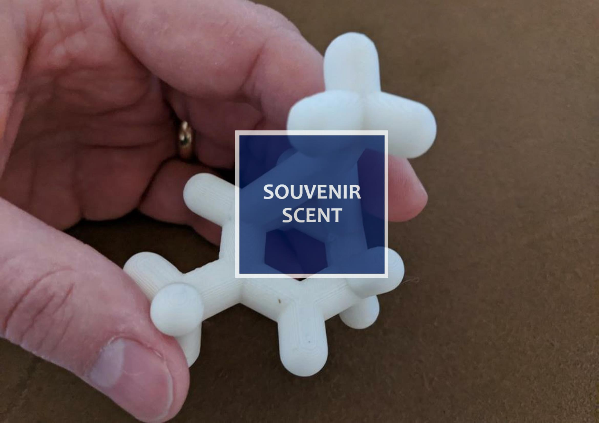
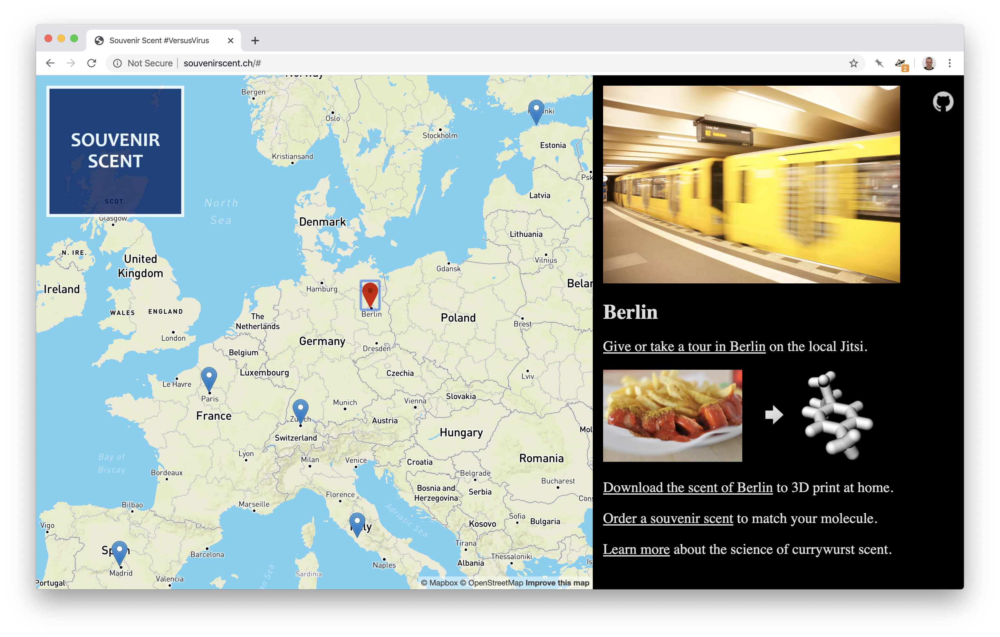

# Souvenir Scent
[Souvenir Scent](http://souvenirscent.ch/) is a [#VersusVirus Hackathon](https://versusvirus.ch/) Project



## Challenge
> [Virtual Tourism](https://airtable.com/shrh5sZgihl4otzgQ/tbl6sM6awYPMu9XbC/viwmAhTo2VVbreodF/rec8zsRYP3fLBmaWM?blocks=hide) - It is not possible to travel, the industry is suffering and it probably will last a long time; people need distractions.

## Team
Laura, Gabriela, Christophe and [@tamberg](https://twitter.com/tamberg).

## Idea
- Virtually visit a place.
- Meet locals or other visitors.
- Get a typical scent as a souvenir.

## Website
- Visit http://souvenirscent.ch/


## Molecules
- [bread-scent.stl](bread-scent.stl)
- [forest-scent.stl](forest-scent.stl)
- [olive-scent.stl](olive-scent.stl)
- [sausage-scent.stl](sausage-scent.stl)
- [sea-scent.stl](sea-scent.stl)

## How it's built
- Static HTML, CSS, Javascript
- Maps made with [Mapbox](https://www.mapbox.com/)
- Domain from [Gandi.net](http://gandi.net/)
- Hosted on [AWS S3](https://docs.aws.amazon.com/AmazonS3/latest/dev/WebsiteHosting.html)

## Run it on your machine
- Type this in a terminal
    ```
    $ git clone https://github.com/tamberg/souvenir-scent
    $ cd souvenir-scent
    $ python -m SimpleHTTPServer 8080 # or any other web server
    ```

- Visit http://127.0.0.1:8080/

## License
- 3D models are licensed [CC BY-SA](https://creativecommons.org/licenses/by-sa/4.0/) G. Chicherio.
- Photos are licensed [CC BY-NC-ND](https://creativecommons.org/) Flickr users.
- Source code is licensed under the [MIT license](https://tamberg.mit-license.org/).
